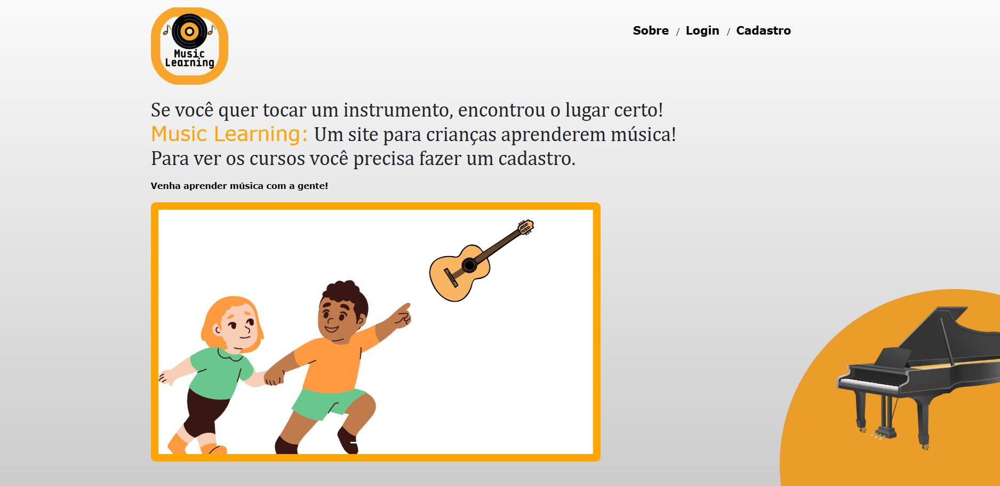
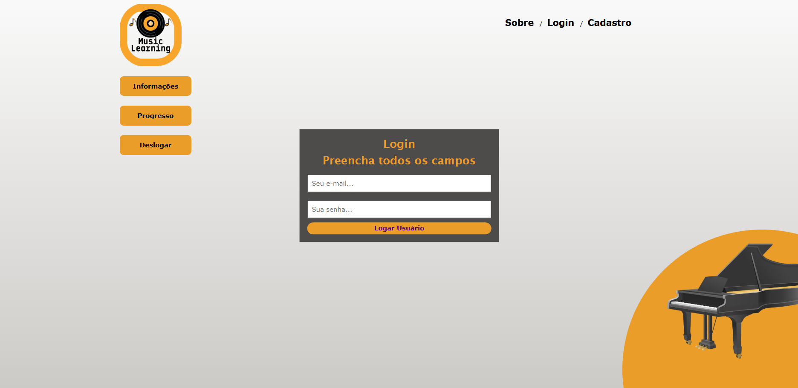

    

# 🎶 Music Learning

**Uma plataforma web criada para ajudar crianças a desenvolverem suas capacidades musicais com piano e violão.**  

[➡️ Acesse a plataforma aqui!](https://musiclearning182.firebaseapp.com)

---

## 📝 Sobre o projeto

**Music Learning** é uma **plataforma educacional** desenvolvida como **Trabalho de Conclusão de Curso (TCC)** na **ETEC Zona Leste** em 2022.  
O objetivo principal é proporcionar um ambiente lúdico e acessível para que crianças aprendam noções básicas de **piano** e **violão**, utilizando recursos interativos e didáticos.

---

## 🚀 Funcionalidades principais

✅ Interface pronta para aulas interativas de piano e violão  
✅ Sistema intuitivo e responsivo 
✅ Suporte a dispositivos móveis via **PWA (Progressive Web App)**  
✅ Exercícios práticos e recursos visuais para estimular o aprendizado  

---

## 🛠️ Tecnologias utilizadas

    
  

---

## 🌐 Como acessar

Acesse a plataforma diretamente pelo link:  
➡️ **[https://musiclearning182.firebaseapp.com](https://musiclearning182.firebaseapp.com)**  

**Dica**: adicione à tela inicial do seu smartphone para aproveitar a experiência como um app nativo!  

---

## 👨‍💻 Equipe de desenvolvimento

- Gustavo Mandu Ferreira Matori  
- Bruce Henzo Inazawa  
- Guilherme Lima Monfardini  

---

## 🎓 Projeto acadêmico

Este projeto foi desenvolvido como parte do **Trabalho de Conclusão de Curso (TCC)** do curso técnico de **Desenvolvimento de Sistemas** da **ETEC Zona Leste**, em 2022.  

---

## 📷 Imagens

---

## 📄 Licença

Este projeto foi desenvolvido com fins **educacionais** e de **demonstração**.

